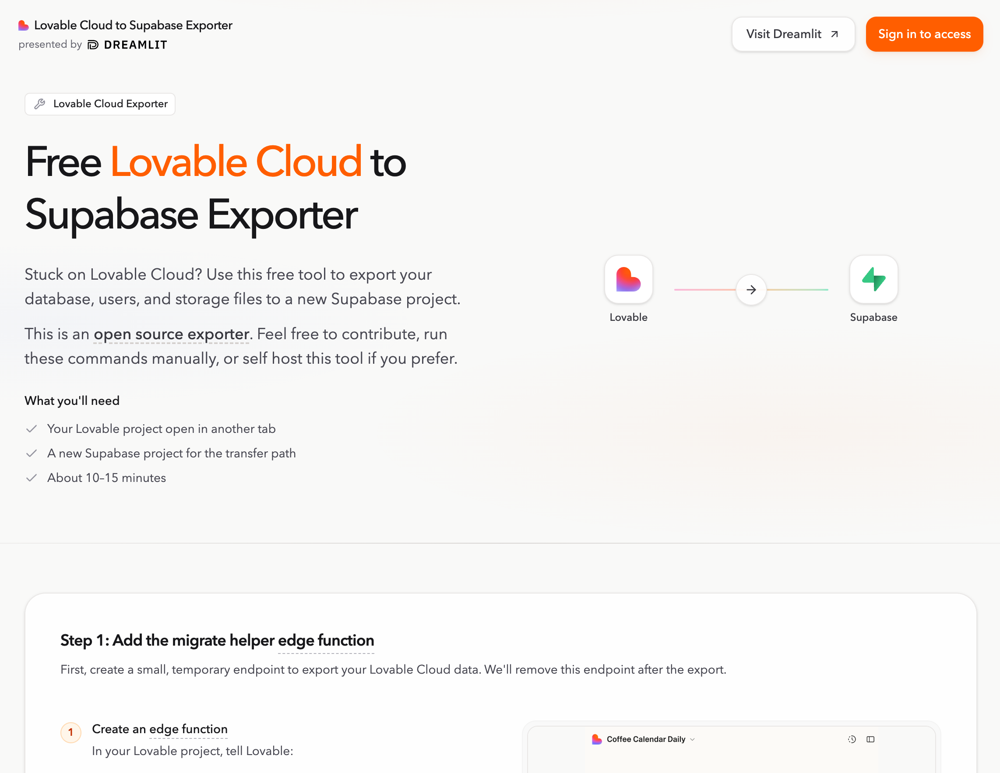

# Lovable Cloud to Supabase Exporter

Move your Lovable Cloud project onto your own Supabase backend (data tables, users, and storage).

This repo gives you the CLI commands and a web UI to run the transfer yourself, locally. It's also [hosted on Dreamlit](https://dreamlit.ai/tools/lovable-cloud-to-supabase-exporter) if you don't want to set anything up.

[](https://dreamlit.ai/tools/lovable-cloud-to-supabase-exporter)

Once your data is on Supabase, you get to pick how you work. Lovable still works great for building and deploying. But if you want to develop in Claude Code, Cursor, or something else, that's on the table too. See the [Choosing How You Build and Host](docs/choosing-how-you-build-and-host.md).

## Requirements

- Node.js 22.x
- pnpm 10.17.1 or a compatible pnpm 10.x release

## Why does this project exist?

Lovable has [documentation](https://docs.lovable.dev/tips-tricks/external-deployment-hosting#what-migrates-and-how) for moving to your own Supabase, but the process is rough:

1. Every user needs to reset their password. If you have real users, that's a non-starter.
2. You're exporting and importing table data via CSV, one table at a time, in the right dependency order.
3. Storage files need to be downloaded and re-uploaded individually.
4. The whole process is incomplete and easy to get wrong.

This tool handles all of it. Tables, users, and storage move to your Supabase backend without password resets or manual work.

## Why move off Lovable Cloud?

Lovable Cloud is great for prototyping, but you might outgrow it:

- Costs add up as usage grows.
- You want direct ownership of your database, storage, and secrets.
- You want to connect external services like [Dreamlit](https://dreamlit.ai) or custom tooling.
- You want less vendor lock-in and more portability over the long term.

This doesn't mean leaving Lovable. You can keep building there while running the backend on your own Supabase, or move your whole workflow to Claude Code, Cursor, or whatever you prefer.

## What doesn't this tool cover?

- API keys, secrets, or third-party service credentials. You'll set these up in your new environment.
- Login provider settings like OAuth configuration or redirect URLs.
- Temporary internal tables (session tokens, migration bookkeeping). These get regenerated automatically.
- App deployment, DNS, or hosting setup.
- The broader app setup. Moving data is usually one step in a larger migration.

## Get started

The fastest way to run the export is the [hosted app](https://dreamlit.ai/tools/lovable-cloud-to-supabase-exporter). No setup needed.

If you'd rather run it yourself:

### Web UI

```bash
pnpm install
cp packages/web-ui/.env.example packages/web-ui/.env.local
pnpm web:dev:full
```

Open `http://localhost:5173/`. The local exporter API runs on `http://127.0.0.1:8799`.

### CLI

```bash
pnpm install
pnpm exporter -- setup edge-function
```

Then follow [Run the Exporter Locally](docs/run-exporter-locally.md) for the full migration flow.

### ZIP export

If you just want the raw data as an artifact instead of a live transfer, the tool supports downloading a ZIP export.

After the export, see the [Choosing How You Build and Host](docs/choosing-how-you-build-and-host.md) for development and hosting options.

## Repository layout

- `packages/web-ui`: React and Vite frontend for the standalone exporter app.
- `packages/cli`: CLI plus the local HTTP API that the web app talks to.
- `packages/core`: Shared migration logic used by the CLI, API, and hosted worker.
- `packages/container-runtime`: Docker runtime used when export or download jobs actually run.
- `packages/cloudflare-exporter-worker`: Hosted Cloudflare deployment path.
- `edge-function`: Source-project helper function that securely returns source credentials during migration.

## Validate and contribute

If you only want to validate the repo or get oriented:

```bash
pnpm install
pnpm check
pnpm test
pnpm build
```

If you want a fast visual check of the product surface, run `pnpm web:dev:full` and click through the app locally.

Contribution guidelines live in [CONTRIBUTING.md](CONTRIBUTING.md).
